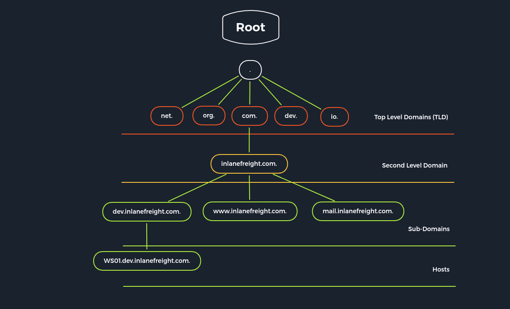

# 逻辑

| 层	| 描述	| 信息分类| 
| -------- | --------------------------------- | ---------------------------- |
| 1. Internet Presence	| 识别互联网存在和外部可访问基础设施。	| 域名、子域名、虚拟主机、ASN、网络块、IP地址、云实例、安全措施| 
| 2. Gateway	| 识别可能的安全措施，以保护公司的外部和内部基础设施。	| 防火墙、DMZ、IPS/IDS、EDR、代理、NAC、网络分段、VPN、Cloudflare| 
| 3. Accessible Services	| 识别可访问的接口和服务，这些服务托管在外部或内部。	| 服务类型、功能、配置、端口、版本、接口| 
| 4. Processes	| 识别与服务相关的内部进程、源和目的地。	| PID、处理数据、任务、源、目的| 
| 5. Privileges	| 识别可访问服务的内部权限和权限。	| 组、用户、权限、限制、环境| 
| 6. OS Setup	| 识别内部组件和系统配置。	| 作系统类型、补丁级别、网络配置、作系统环境、配置文件、敏感私有文件| 

# Internet Presence
1. 从ssl证书角度出发：SSL certificate查来源有哪些域名，使用https://crt.sh/
2. dns查询搜索的域名，host（快速查询a记录的存活host）和dig命令（详细返回和CDN调度检查），
   - A记录：我们通过A记录识别指向特定（子）域名的IP地址。
   - MX 记录：邮件服务器记录告诉我们哪家邮件服务器负责处理该公司的电子邮件。
   - NS 记录：这类记录显示用于将完全限定域名（FQDN）解析为 IP 地址的权威域名服务器。大多数托管商会使用自己的 NS，因而能更容易地识别出托管商是谁。
   - TXT 记录：这种记录通常包含面向不同第三方服务商的验证密钥，以及 DNS 的其他安全要素

# Cloud
云存储对应
- Amazon (AWS) - S3 buckets
- Google (GCP) - cloud storage
- Microsoft (Azure) -  blobs

通过云储存搜索文件google dork高级语法
inurl:amazonaws.com and intext:dns的txt
inurl:blob.core.windows.net and intext:dns的txt

## 终端里进行搜索引擎搜索的方式
1. lynx: 简易上古浏览器
2. googler:封装的google搜索

## 域名检查
- Domain.Glass：国外版站长之家
- GrayHatWarfare：在线搜索引擎，专门对互联网上公开暴露的 Amazon S3 存储桶（Bucket）及文件进行持续爬取与索引，用户可通过关键词、文件后缀、正则表达式等方式快速定位这些云存储资源。其核心定位是“云存储侧漏雷达”

# 主机服务枚举

## FTP文件服务
- FTP：TCP 21端口是control channel,数据交换在TCP 20（仅主动模式用）。模式包含： active and passive。高危用户anonymous
  - 在活动模式（active mode）中，数据通道TCP 20可能会，被客户端防火墙拦截如果没放行。因为是服务器20 -> 客户端port，流量入被拦截。
  - 被动模式种，是服务器指定动态port等待客户端回连。客户端port -> 服务器port，流量出不拦截。
  linux内置的版本时vsFTPd,用户在/etc/ftpusers，配置在/etc/vsftpd.conf,配置选项说明：
  - listen=NO：从 inetd 运行或作为独立守护进程运行standalone daemon
  - anonymous_enable=NO：匿名用户，yes是危险的
  - anon_upload_enable=YES：匿名上传，危险
  - anon_mkdir_write_enable=YES：匿名创建，危险
  - no_anon_password=YES：匿名无需密码，危险
  - anon_root=/home/username/ftp：匿名用户路径配置，危险
  - write_enable=YES：ftp可执行写入权限，危险
  - chown_uploads=YES：修改匿名用户的ownership
  - chown_username=username：匿名文件的文件权限赋予给哪个本地用户
  - chroot_local_user=YES：将本地用户放入他们的主目录
  - ls_recurse_enable=YES：允许递归展开
  - hide_ids=YES：服务的 UID 和 GUID 表示将被覆盖，更难确定这些文件是以何种权限创建和上传的，因为owner都是ftp
  - local_enable=YES：本地用户登录
  - dirmessage_enable=YES：当用户进入特定目录时显示活动目录消息
  - use_localtime=YES：是否使用本地时间同步
  - xferlog_enable=YES：上传下载日志是否开启
  - connect_from_port_20=YES：是否20端口
  - pam_service_name=vsftpd：使用的pam服务
  - rsa_cert_file=/etc/ssl/certs/ssl-cert-snakeoil.pem：公钥配置
  - ssl_enable=NO：ssl连接
  常见命令FTP中：
  - status：状态
  - debug
  - trace：追踪
  - ls -R：递归查询文件
  - put：上传
  - get：下载
  - !cat：直接读文件
- TFTP（Trivial File Transfer Protocol）：基于UDP,没有授权，很不安全，命令包含：connect，get，put, quit, status, verbose。没有list文件的选项

## SMB文件服务Server Message Block 
权限控制通过 Access Control Lists (ACL)，包含： execute, read, full access
### Samba服务smb server
基于 Common Internet File System (CIFS) network协议，微软创建，又称SMB/CIFS.旧的NetBIOS service服务，通常是TCP ports 137, 138，139。CIFS 是在445
- SMB version 1：Windows 2000支持，TCP直连
- SMB 2.0：	Windows Vista, Windows Server 2008以上，比smb1缓存更好
- SMB 2.1：Windows 7, Windows Server 2008 R2以上，锁定机制
- SMB 3.0：Windows 8, Windows Server 2012，支持远程存储，多交互等
- SMB 3.0.2：Windows 8.1, Windows Server 2012 R2
- SMB 3.1.1：Windows 10, Windows Server 2016。完整性校验+AES-128 encryption
  
在 Samba 3 版本中，Samba 引入了成为 Active Directory (AD) 域的成员 的能力。也就是说，Samba 3 可以作为一个 Windows 域环境中的客户端加入到域中。在 Samba 4 中，Samba 的功能得到了显著增强，它不再仅仅是一个域成员，它还可以充当 Active Directory 域控制器 (Domain Controller, DC)。配置包括：

- [sharename]：share的名字
- workgroup = WORKGROUP/DOMAIN：所属工作组
- path = /path/here/ ：进入路径
- server string = STRING：连接回显的server
- unix password sync = yes：UNIX password同步
- usershare allow guests = yes：允许guest
- map to guest = bad user：用户不匹配报错
- browseable = yes：list可用文件，高危配置
- guest ok = yes：guest不用密码，高危配置
- read only = yes：是否只读，高危配置
- writable = yes：允许用户可写，高危配置
- create mask = 0700：新创建的文件需要设置权限，新创建的文件必须分配哪些权限
- enable privileges = yes：授予特定 SID 的权限，高危配置
- directory mask = 0777：新创建的目录必须分配哪些权限
- logon script = script.sh：登录的脚本
- magic script = script.sh：关闭时的脚本
- magic output = script.out：magic脚本位置

IPC$ 共享是一个特殊的、虚拟的管理共享，它本身不绑定到文件系统上的任何一个具体路径（Path）。它的主要作用不是用来访问文件，而是为了进行远程管理和通信。IPC$ 是 Inter-Process Communication，即进程间通信。它提供了一个“命名管道”，允许客户端和服务器之间进行通信，以执行各种管理任务。例如，当你使用 net use 命令连接服务器、查看共享列表、启动/停止服务、访问注册表等操作时，底层都在通过 IPC$ 通道进行通信。
print$ 打印机共享和 IPC$ 已经在基本设置中默认包含， Remote Procedure Call (RPC)使用rpcclient，命令：
- srvinfo：服务器信息
- enumdomains：枚举所有域内域名
- querydominfo：提供已部署域的域名、服务器和用户信息。
- netshareenumall：枚举所有的share
- netsharegetinfo <share>：某个share的全部信息
- enumdomusers：枚举所有用户
- queryuser <RID>：具体用户信息

## NFS服务Network File System
- NFSv2：最老的，UDP
- NFSv3：与NFSv2不兼容，增加了报错机制文件size等优化
- NFSv4：Kerberos授权，使用ACL控制。NFS version 4.1 (RFC 8881)使用session trunking的机制可以在分布式系统中分发。UDP or TCP port 2049

NFS4之前都是 Open Network Computing Remote Procedure Call (ONC-RPC/SUN-RPC) 协议簇， TCP and UDP ports 111。使用 External Data Representation (XDR) 交换数据。4之前都不需要授权，授权和验证仅是RPC的可选项，一般通过unix的group进行验证控制。配置文件在/etc/exports，包含：
- rw（高危）：可读写
- ro：仅可读
- sync：数据同步传输
- async：异步传输数据
- secure：禁用1024端口，1024 端口以下的端口被认为是“系统端口”或“特权端口”，通常是被系统和核心服务使用的端口。具体来说，端口 1024 以下的端口 是由操作系统保留和分配给系统级服务使用的。
- insecure（高危）：启用1024端口
- no_subtree_check：禁止递归查看文件树
- root_squash（高危）：控制通过 NFS 挂载的文件系统上，root 用户（UID 0）的访问权限。启用 root_squash 后，所有来自客户端 root 用户的请求都会被重定向到 匿名用户 的权限。
- nohide（高危）：在 NFS 环境中，通常当你挂载一个子目录时，该子目录不会被视为该文件系统的一部分，直到你明确地将它导出。如果你将某个目录导出，并且该目录下面有一个子目录挂载了其他文件系统，NFS 默认是不公开（hide）这个子目录的挂载信息的

## DNS服务Domain Name System
DNS servers类型：
- DNS root server：复制顶级域名 top-level domains (TLD)，全世界13家 Internet Corporation for Assigned Names and Numbers (ICANN) 控制
- Authoritative name server：某个特定域名区域（Zone）的 DNS 服务器。它们保存着关于该区域的 权威 信息，并且只会回答自己负责的域名区域中的查询。这些信息是 绑定的，也就是说，它们是最准确的，不会被修改或依赖其他来源。
- Non-authoritative name server：非权威 DNS 服务器的存在是为了提供 更高效的 DNS 查询服务，并且实现 更好的负载均衡 和 冗余。它们通常作为 递归 DNS 服务器 或 缓存 DNS 服务器 存在，在提升 DNS 查询速度和减少 DNS 服务器负担方面发挥着重要作用。非权威 DNS 服务器 通常是 递归 DNS 服务器，它的功能是根据客户端的查询，通过向其他 DNS 服务器发起查询，最终获得解析结果并返回给客户端。
- Caching server：缓存 DNS 服务器 侧重于 存储和返回缓存的 DNS 记录，而 非权威 DNS 服务器 侧重于 通过递归查询找到权威 DNS 服务器并获取解析结果。在实际使用中，缓存 DNS 服务器常常是非权威 DNS 服务器的一部分，因为大多数非权威 DNS 服务器都会使用缓存来提高效率。
- Forwarding server:把请求“转发”给上游DNS服务器,比如上网行为管理，仅作为指向
- Resolver：本地域名解析

DNS服务不加密，如果要加密使用 DNS over TLS (DoT) or DNS over HTTPS (DoH) here. In addition, the network protocol DNSCrypt 


DNS记录：
- A: IPv4
- AAAA: IPv6
- MX: 邮件服务器
- NS：DNS服务器（resolver）
- TXT：各种验证机制的载体。SSL 证书验证（域名控制验证 DCV），Google Search Console 验证等，SPF（反伪造发件人）。DKIM（邮件签名验证）。DMARC（邮件策略 + 报告）
- CNAME：别名
- PTR：反向解析，邮件“身份可信度”验证
- SOA:Start of Authority权威记录，domain的权威信息

常用的DNS服务器bind9,配置文件在/etc/bind/named.conf，分成两部分：general settings和individual domains。包括：
- named.conf.local
- named.conf.options
- named.conf.log

### Local DNS Configuration
DNS配置目录文件，告诉 DNS 服务器：“我对哪些域名是权威的”，哪些 zone（DNS 区域）由这台服务器来管理
```
zone "domain.com" {
    type master;
    file "/etc/bind/db.domain.com";
    allow-update { key rndc-key; };
};
```
- DNS 区域: domain.com
- type类型: 主 DNS 服务器（Primary / Master）,zone 数据的“源头”。类型包括：master（主服务器，可编辑区域数据），slave（从服务器，从 master 同步），forward（仅做转发，不权威）。不常用的type，包括hint（告诉 DNS 服务器“根 DNS 服务器是谁”），stub（只同步对方 zone 的 NS 记录，不保存完整数据，主要跨组织 DNS 结构引用）
- file:DNS记录存放位置，当前是/etc/bind/db.domain.com
- allow-update：允许使用 rndc-key 这个密钥进行动态 DNS 更新，支持 DDNS（Dynamic DNS）允许使用TSIC可以客户端或系统可以自动修改 DNS 记录，比如DHCP 服务器自动注册主机名，AD 域环境自动更新主机记录

### Zone Files
Local DNS Configuration中的DNS记录.必须有SOA，和至少一个NS记录。SERVFAIL error message配置项用于报错回复。FQDN = 完整主机名 + 域名 + 根（点）。当前配置中存在多节点每个节点的FQDN不同

```
;
; BIND reverse data file for local loopback interface
;
$ORIGIN domain.com
$TTL 86400
@     IN     SOA    dns1.domain.com.     hostmaster.domain.com. (
                    2001062501 ; serial
                    21600      ; refresh after 6 hours
                    3600       ; retry after 1 hour
                    604800     ; expire after 1 week
                    86400 )    ; minimum TTL of 1 day

      IN     NS     ns1.domain.com.
      IN     NS     ns2.domain.com.

      IN     MX     10     mx.domain.com.
      IN     MX     20     mx2.domain.com.

             IN     A       10.129.14.5

server1      IN     A       10.129.14.5
server2      IN     A       10.129.14.7
ns1          IN     A       10.129.14.2
ns2          IN     A       10.129.14.3

ftp          IN     CNAME   server1
mx           IN     CNAME   server1
mx2          IN     CNAME   server2
www          IN     CNAME   server2
```

### Reverse Name Resolution Zone Files（PTR）

```
root@bind9:~# cat /etc/bind/db.10.129.14

;
; BIND reverse data file for local loopback interface
;
$ORIGIN 14.129.10.in-addr.arpa
$TTL 86400
@     IN     SOA    dns1.domain.com.     hostmaster.domain.com. (
                    2001062501 ; serial
                    21600      ; refresh after 6 hours
                    3600       ; retry after 1 hour
                    604800     ; expire after 1 week
                    86400 )    ; minimum TTL of 1 day

      IN     NS     ns1.domain.com.
      IN     NS     ns2.domain.com.

5    IN     PTR    server1.domain.com.
7    IN     MX     mx.domain.com.
...SNIP...
```
- $ORIGIN :反向解析的网段

### DNS的不安全配置
- allow-query：控制哪些客户端被允许向这台 DNS 服务器发起查询请求，写在全局 options {} 里（影响整个服务器）或者单个 zone {} 里（只影响某个域），在某些版本里，没写默认any，导致内网暴露DNS
- allow-recursion：定义DNS 服务器“帮忙去外面查答案”，如果设置yes导致开放递归服务器，需要结合allow-query做控制
- allow-transfer：允许谁做 Zone Transfer（区域传送），DNS的主从同步机制，从master拿到全部dns记录。如果配置了allow-transfer { any; };攻击者使用dig axfr domain.com @dns-server-ip就能拉过来全部DNS的记录
- zone-statistics：zone里的统计数据，如果 allow { any; }还配置0.0.0.0，就会统计泄露