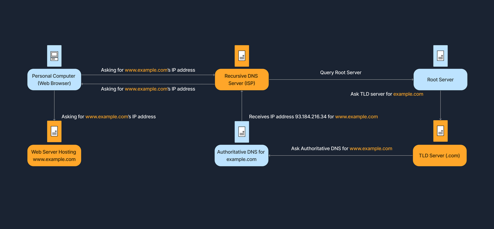

# Dynamic Host Configuration Protocol (DHCP)
## DHCP工作方式
服务器请求过程为dora（ Discover, Offer, Request, and Acknowledge）包括：
- DHCP Server：IP池
- DHCP Client：接受消息
过程：
1. 发现：设备连网时，广播DHCP Discover消息，获取可用dhcp服务器
2. Offer：网络上的 DHCP 服务器接收发现消息，并以 DHCP 提供消息响应，向客户端提出 IP 地址租用建议，这个offer不会是永久的ip需要定期轮询。
3. request: 客户端收到Offer会发送一个 DHCP 请求消息，表示它接受所提供的 IP 地址。
4. Acknowledge: 服务器确认请求

抓包要有wireshark

# Network Address Translation (NAT)
RFC 1918定义，常见的IPv4私有地址范围包括10.0.0.0至10.255.255.255,172.16.0.0至172.31.255.255，以及192.168.0.0至192.168.255.255。
路由器的NAT功能将数据包头部中的源IP从私有IP改为路由器的公网IP.该数据包随后会穿越互联网，最终到达目标的网络服务器。收到数据包后，网页服务器会向路由器的公共IP发送回应。响应到来后，路由器的NAT表（负责跟踪IP映射）识别出203.0.113.50：4444对应于192.168.1.10：5555（端口4444和5555为动态端口）。NAT映射类型有：
- Static NAT：涉及一对一映射，每个私有IP地址直接对应一个公共IP地址。
- Dynamic NAT：根据网络需求，从可用地址池中分配一个公网IP到私有IP。
- Port Address Translation (PAT)：NAT过载，是家庭网络中最常见的NAT形式。多个私有IP地址共享一个公共IP地址，通过使用唯一的端口号区分连接。这种方法广泛应用于家庭和小型办公网络，允许多台设备共享一个公共IP地址以便上网。

# Domain Name System(DNS)
## DNS Hierarchy
- Root Servers: top of the DNS hierarchy.根服务器
- Top-Level Domains (TLDs)：Such as .com, .org, .net, or country codes like .uk, .de.
- Second-Level Domains：二级域名example.com的example
- Subdomains or Hostname：比如www，accounts.google.com的account等
# DNS Resolution Process解析过程
1. 先本地DNS缓存
2. 没有查recursive DNS server第三方的
3. 发到root server查TLD name server，比如.com
4. 然后查，authoritative name server的二级域名，比如example.com
5. authoritative name server响应Hostname比如www.example.com
6. recursive server（ISP）返回ip地址连上去
   

# Firewalls
- Packet Filtering Firewall:在OSI模型的第3层（网络层）和第4层（传输层）运行。检查源/目的IP、源/目的端口以及协议类型。
- Stateful Inspection Firewall: 跟踪网络连接的状态。比数据包过滤器更智能，因为它们能够理解整个通信对话。
- Application Layer Firewall (Proxy Firewall):OSI模型的第7层（应用层）。可以检查流量的实际内容（例如HTTP请求）并阻止恶意请求。
- Next-Generation Firewall (NGFW)

- 入侵检测系统（IDS）监控流量或系统事件，以识别恶意行为或策略违规行为，生成警报但不阻止可疑流量。
- 入侵防御系统（IPS）的运作方式与IDS类似，但增加了实时防止或拒绝恶意流量的步骤。关键区别在于它们的操作方式：IDS是检测并警报，而IPS是检测并防御。
- Network-Based IDS/IPS (NIDS/NIPS):在网络的关键位置部署的硬件设备或软件解决方案，用于检查所有通过的流量。
- Host-Based IDS/IPS (HIDS/HIPS):在单独的主机或设备上运行，监控该机器的入站/出站流量和系统日志，以检测可疑行为。