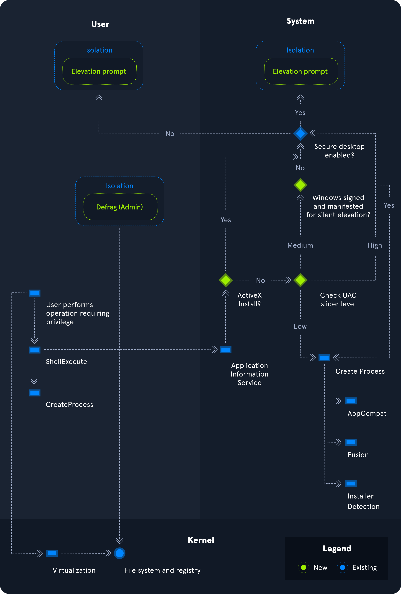

# windows世界
Windows 是「对象世界」在 Windows 里：服务（Service），进程（Process），文件，注册表，WMI 类，全部都是对象（securable objects）。都有 ACL / DACL / SDDL
* 服务本质：一个可执行程序 + 一组配置 + 权限信息。每个服务都有：服务名 / 显示名，启动类型（自动/手动/禁用），可执行路径（BinPath），依赖服务，权限 / 所属账户（LocalSystem / NetworkService / 用户），这些信息大部分都存储在 注册表里，不是单独存在在系统里。

* windows除了GUI桌面版，还有Server Core版本，跟linux一样不带桌面的服务器
* wuauserv是windows更新

# 文件系统
类型包括：FAT12, FAT16, FAT32（USB和SD卡）, NTFS。windows基本上是NTFS
## NTFS权限
| Type | 类型（中文） | Description | 描述（中文） |
|------|--------------|-------------|--------------|
| **Full Control** | 完全控制 | Allows reading, writing, changing, and deleting of files and folders. | 允许读取、写入、修改以及删除文件和文件夹。 |
| **Modify** | 修改 | Allows reading, writing, and deleting of files and folders. | 允许读取、写入以及删除文件和文件夹，但不包含更改权限设置。 |
| **List Folder Contents** | 列出文件夹内容 | Allows viewing and listing folders and subfolders, as well as executing files. This permission applies to folders only. | 允许查看和列出文件夹及其子文件夹，并允许执行文件。该权限仅适用于文件夹。 |
| **Read and Execute** | 读取和执行 | Allows viewing and listing files and subfolders, as well as executing files. This permission applies to both files and folders. | 允许查看和列出文件及子文件夹，并允许执行文件。该权限同时适用于文件和文件夹。 |
| **Write** | 写入 | Allows adding files to folders and subfolders, and writing to a file. | 允许向文件夹及子文件夹中添加文件，并向文件写入内容。 |
| **Read** | 读取 | Allows viewing and listing folders and subfolders, and viewing a file’s contents. | 允许查看和列出文件夹及子文件夹，并查看文件内容。 |
| **Traverse Folder** | 穿越文件夹 | Allows or denies the ability to move through folders to reach other files or folders. | 允许或拒绝用户穿越文件夹路径以访问其他文件或文件夹。即使用户无权列出目录内容或查看文件，只要拥有“穿越文件夹”权限，仍可直接访问目标路径中的文件。 |

## 资源访问级别说明:
- (CI)：Container Inherit（容器继承）  
  权限会被子文件夹继承。

- (OI)：Object Inherit（对象继承）  
  权限会被文件继承。

- (IO)：Inherit Only（仅继承）  
  权限不会作用于当前对象，只会传递给子对象。

- (NP)：No Propagate Inherit（不传播继承）  
  权限不会继续向更深层级的子对象传播。

- (I)：Inherited  
  该权限是从父容器继承而来。

## 基本访问权限
| 权限标识 | 英文含义 | 中文说明 |
|---------|----------|----------|
| **F** | Full Access | 完全控制 |
| **D** | Delete Access | 删除权限 |
| **N** | No Access | 无访问权限 |
| **M** | Modify Access | 修改权限 |
| **RX** | Read and Execute Access | 读取并执行权限 |
| **R** | Read-only Access | 只读权限 |
| **W** | Write-only Access | 仅写入权限 |

## Share Permissions（共享权限）
适用场景：通过 SMB 网络访问 共享文件夹时生效
| Permission | 描述 |
|-----------|------|
| **Full Control** | 允许执行 Change 和 Read 的所有操作，并且可以更改 NTFS 文件和子文件夹的权限 |
| **Change** | 允许读取、编辑、删除以及添加文件和子文件夹 |
| **Read** | 允许查看文件和子文件夹的内容 |

## NTFS Special Permissions（NTFS 特殊权限）
| Permission | 描述 |
|-----------|------|
| **Full Control** | 允许添加、编辑、移动、删除文件和文件夹，并更改 NTFS 权限 |
| **Traverse Folder / Execute File** | 即使父目录无访问权限，也允许穿越目录访问子文件夹或执行文件 |
| **List Folder / Read Data** | 允许查看父目录下的文件和子文件夹，并读取文件内容 |
| **Read Attributes** | 允许查看基本属性（如 system、archive、read-only、hidden） |
| **Read Extended Attributes** | 允许查看扩展属性（依程序不同而变化） |
| **Create Files / Write Data** | 允许在文件夹中创建文件并修改文件内容 |
| **Create Folders / Append Data** | 允许创建子文件夹，并向文件追加内容（不可覆盖原内容） |
| **Write Attributes** | 允许修改文件属性（不包含创建文件或文件夹） |
| **Write Extended Attributes** | 允许修改扩展属性 |
| **Delete Subfolders and Files** | 允许删除子文件夹和文件（不影响父文件夹） |
| **Delete** | 允许删除父文件夹、子文件夹及文件 |
| **Read Permissions** | 允许读取文件或文件夹的权限信息 |
| **Change Permissions** | 允许更改文件或文件夹的权限 |
| **Take Ownership** | 允许取得文件或文件夹的所有权（所有者可更改所有权限） |

## Share Permissions（共享权限）和NTFS对比
- NTFS 权限仅作用于文件和文件所在的系统
- 新创建的 NTFS 文件夹默认继承父文件夹权限
- 可以关闭继承（Disable Inheritance）来自定义父目录或子目录权限
- Share 权限只在通过 SMB 网络访问时生效
- 本地登录或通过 RDP 访问文件时，只需考虑 NTFS 权限
- 实际生效权限 = Share 权限 ∩ NTFS 权限（取最严格）
- NTFS 权限提供比 Share 权限更细粒度的控制能力

## Windows Defender Firewall的影响
防火墙默认规则可能只允许同组 / 同域设备访问，阻止来自“外部 / 未识别网络”的 SMB 流量。所以访问时很可能遇到，端口开着且用户存在，但 SMB 连接失败 / 超时 / 拒绝
- Workgroup vs Domain认证流向：
  - Workgroup环境，用户账户存在认证来源是local：本机 SAM 数据库C:\Windows\System32\config\SAM
  - domain环境，认证来源是Active Directory：netlogon 请求交给 DC，账户统一管理，本机不再维护用户密码
所以必须知道账户是在哪个环境。

防火墙配置基于规则，允许 / 拒绝入站和出站流量：
- Public  （最严格）
- Private
- Domain  （最宽松）

特殊权限：Everyone 组，如果是该组权限，只能读

SMB 访问问题，永远从 三件事查起：
防火墙 → 账号认证来源（SAM / AD）→ Share 权限 ∩ NTFS 权限

## windows的Computer Management和Event Viewer
可以管理共享文件夹

# Working with Services & Processes
windows服务通过 Service Control Manager (SCM) system管理，进程是services.msc。查看服务的命令是：sc.exe using PowerShell cmdlets such as Get-Service.

## 服务的类型
- Local Services
- Network Services
- System Services

## Windows 系统关键服务（Services）

| Service | Description | 中文说明 |
|---------|------------|----------|
| **smss.exe** | Session Manager SubSystem. Responsible for handling sessions on the system. | 会话管理子系统。负责系统上的会话管理。 |
| **csrss.exe** | Client Server Runtime Process. The user-mode portion of the Windows subsystem. | 客户端/服务器运行时进程。Windows 子系统的用户模式部分。 |
| **wininit.exe** | Starts the Wininit file .ini file that lists all of the changes to be made to Windows when the computer is restarted after installing a program. | 启动 Wininit.ini 文件，该文件记录在安装程序后重启 Windows 时需要执行的系统更改。 |
| **logonui.exe** | Used for facilitating user login into a PC | 负责用户登录界面，便于用户登录计算机。 |
| **lsass.exe** | The Local Security Authentication Server verifies the validity of user logons to a PC or server. It generates the process responsible for authenticating users for the Winlogon service. | 本地安全认证服务。验证用户在 PC 或服务器上的登录有效性，并生成进程以为 Winlogon 服务进行用户认证。 |
| **services.exe** | Manages the operation of starting and stopping services. | 管理 Windows 系统服务的启动和停止操作。 |
| **winlogon.exe** | Responsible for handling the secure attention sequence, loading a user profile on logon, and locking the computer when a screensaver is running. | 负责处理安全注意序列（Ctrl+Alt+Del）、登录时加载用户配置文件，以及屏保运行时锁定计算机。 |
| **System** | A background system process that runs the Windows kernel. | 系统后台进程，运行 Windows 内核。 |
| **svchost.exe with RPCSS** | Manages system services that run from dynamic-link libraries (files with the extension .dll) such as "Automatic Updates," "Windows Firewall," and "Plug and Play." Uses the Remote Procedure Call (RPC) Service (RPCSS). | 管理基于 DLL 的系统服务（如自动更新、Windows 防火墙、即插即用）。使用远程过程调用（RPC）服务。 |
| **svchost.exe with Dcom/PnP** | Manages system services that run from dynamic-link libraries (files with the extension .dll) such as "Automatic Updates," "Windows Firewall," and "Plug and Play." Uses the Distributed Component Object Model (DCOM) and Plug and Play (PnP) services. | 管理基于 DLL 的系统服务（如自动更新、Windows 防火墙、即插即用）。使用分布式组件对象模型（DCOM）和即插即用服务。 |

## Local Security Authority Subsystem Service (LSASS)
lsass.exe 是负责在 Windows 系统上执行安全策略的进程。当用户尝试登录系统时，该进程会验证他们的登录尝试，并根据用户的权限级别创建访问令牌。LSASS 还负责用户账户密码的更改。与此进程相关的所有事件（登录/注销尝试等）都会记录在 Windows 安全日志中。LSASS 是一个极其高价值的目标，因为存在多种工具可以提取该进程内存中存储的明文和哈希凭据。

## Sysinternals 工具
一套 **便携式 Windows 工具集**，主要用途：管理和监控 Windows 系统。主要工具：

| 工具 | 功能 | 中文说明 |
|------|------|----------|
| **Process Explorer** | 增强版 Task Manager，可查看详细进程信息 | 增强任务管理器，用于查看系统中所有进程及其句柄、DLL 等信息 |
| **Process Monitor** | 监控文件系统、注册表和网络活动 | 文件、注册表、网络监控工具，可跟踪任意进程的操作 |
| **TCPView** | 监控网络/Internet 活动 | 查看系统上所有 TCP/UDP 连接及状态 |
| **PSExec** | 通过 SMB 协议远程管理/连接系统 | 远程执行命令和管理系统工具，可用于渗透测试 |

## 权限
大多数服务默认使用LocalSystem权限，这是单个Windows作系统允许的最高访问权限。Windows中著名的非交互式内置服务账户：
- LocalService：是 SYSTEM 账户的权限较低版本，权限类似于本地用户账户。它被赋予有限的功能，并能启动部分服务。NT AUTHORITY\LocalService
- NetworkService：标准的域用户账户。它拥有与本地机器上的本地服务账户类似的权限。它可以为某些网络服务建立认证会话。NT AUTHORITY\NetworkService
- LocalSystem：是Windows系统中最强大的账户。它被用于各种作系统相关的任务，比如启动 Windows 服务。这个账户比本地管理员组的账户更强大。NT AUTHORITY\SYSTEM

显示服务的安全描述符：.Discretionary Access Control List(DACL)控制“谁能做什么”和System Access Control List(SACL)审计/记录访问行为

- Security Descriptor Definition Language安全描述符：对象的所有者（Owner），主组（Primary Group），DACL（Discretionary Access Control List），SACL（System Access Control List）

 PowerShell 的 **Execution Policy（执行策略）** 是一种安全机制，用于防止执行恶意脚本。 在渗透测试中，如果脚本无法运行，通常就是策略限制导致的。

 | Policy | Description | 中文说明 |
|--------|------------|----------|
| **AllSigned** | 所有脚本都可以运行，但必须由受信任发布者签名，包括本地和远程脚本。未信任的签名会提示用户确认。 | 所有脚本需签名运行，未信任的发布者会提示确认。 |
| **Bypass** | 不阻止任何脚本或配置文件，用户也不会收到提示。 | 完全绕过策略，不提示，不阻止。 |
| **Default** | 默认策略：Windows 桌面为 Restricted，Windows 服务器为 RemoteSigned。 | 默认策略：桌面受限，服务器要求远程签名。 |
| **RemoteSigned** | 本地脚本可以运行，但从互联网下载的脚本必须有数字签名。 | 本地脚本无需签名，远程脚本需签名。 |
| **Restricted** | 只允许单条命令，不允许运行任何脚本文件（包括 `.ps1`、`.psm1`、`.ps1xml`）。 | 仅支持单条命令，不允许执行任何脚本。 |
| **Undefined** | 当前作用域未设置策略。如果所有作用域都是 Undefined，则使用默认策略 Restricted。 | 未定义策略，按默认 Restricted 执行。 |
| **Unrestricted** | 非 Windows 计算机的默认策略，允许执行未签名脚本，但运行来自非本地内网的脚本时会提示警告。 | 允许未签名脚本，非本地内网脚本运行前会提示警告。 |

# Windows Management Instrumentation (WMI)
WMI 是 PowerShell 的一个子系统，为系统管理员提供强大的系统监控工具。WMI 的目标是在企业网络中整合设备和应用程序管理。
# WMI（Windows Management Instrumentation）组件笔记
Windows 系统提供的一套 管理基础设施，访问系统信息（CPU、内存、磁盘、进程、服务、网络等），配置和管理系统（启动/停止服务、修改用户、调整设置），主要运维批量打补丁用的

| Component Name | Description | 中文说明 |
|----------------|------------|----------|
| **WMI service** | The Windows Management Instrumentation process, which runs automatically at boot and acts as an intermediary between WMI providers, the WMI repository, and managing applications. | Windows 管理工具服务（WMI 服务），开机自动启动，充当 WMI 提供者、WMI 仓库和管理应用之间的中介。 |
| **Managed objects** | Any logical or physical components that can be managed by WMI. | 可被 WMI 管理的逻辑或物理组件。 |
| **WMI providers** | Objects that monitor events/data related to a specific object. | 监控特定对象的事件或数据的提供者对象。 |
| **Classes** | These are used by the WMI providers to pass data to the WMI service. | WMI 提供者用来向 WMI 服务传递数据的类。 |
| **Methods** | These are attached to classes and allow actions to be performed. For example, methods can be used to start/stop processes on remote machines. | 类附带的方法，可执行操作。例如，可以用来远程启动或停止进程。 |
| **WMI repository** | A database that stores all static data related to WMI. | WMI 仓库，存储与 WMI 相关的所有静态数据。 |
| **CIM Object Manager** | The system that requests data from WMI providers and returns it to the application requesting it. | CIM 对象管理器，从 WMI 提供者请求数据并返回给调用应用程序的系统。 |
| **WMI API** | Enables applications to access the WMI infrastructure. | WMI API，使应用程序能够访问 WMI 基础设施。 |
| **WMI Consumer** | Sends queries to objects via the CIM Object Manager. | WMI 消费者，通过 CIM 对象管理器向对象发送查询。 |

## WMIC（WMI Command-line）/Get-WmiObject 
WMI 的 命令行接口（CLI）工具，让普通用户在命令行直接访问 WMI 功能，可以快速查询系统信息或修改配置。wmic ≈ Linux 里的 ps / kill / systemctl / ssh 的集合
| 特性         | WMI                                | Task Manager | Services                    |
| ---------- | ---------------------------------- | ------------ | --------------------------- |
| **访问方式**   | CLI / API / PowerShell / WMIC / 程序 | GUI          | GUI / CLI / PowerShell      |
| **本地/远程**  | 本地 & 远程                            | 仅本地          | 本地 & 可远程（WMIC / PowerShell） |
| **主要用途**   | 查询 & 管理系统对象（进程、服务、用户、网络）           | 监控 & 管理本地进程  | 管理系统服务 & 启动项                |
| **操作级别**   | 可以深度调用对象方法                         | 仅基本操作        | 深度控制服务（启动/停止/修改路径）          |
| **渗透测试价值** | 高：信息收集、提权、远程管理                     | 中：快速查看、调试    | 高：提权、权限绕过、横向移动              |

## WMI的价值
| 优势             | 说明                         |
| -------------- | -------------------------- |
| **远程管理**       | 可以不登录 GUI 就操作远程系统          |
| **低权限操作高权限对象** | 利用服务或任务计划提权，查看 SYSTEM 权限服务 |
| **自动化与批量操作**   | 一条命令获取大量信息（进程、服务、用户、软件）    |
| **隐蔽性**        | 不依赖 Task Manager，通常日志较少    |

# Microsoft Management Console (MMC)
可以使用 MMC 创建自定义工具并分发给用户。MMC 基于加载单元的概念，允许管理员创建一个定制的控制台，仅包含管理多个服务所需的管理工具。这些加载单元可以用于管理本地和远程系统。通用管理框架，本身不管理服务，不管理用户，不管理注册表，它只做一件事加载“管理插件（Snap-in）。

.msc 本质MMC + 某个 Snap-in 的配置文件。比如services.msc是MMC + Services Snap-in。MMC 只是 GUI 容器，权限完全取决于你当前用户的 Token

[ MMC ]
   ↓ (加载 Snap-in)
[ Services Snap-in ]
   ↓
[ SCM (Service Control Manager) ]
   ↓
[ 注册表: HKLM\SYSTEM\CCS\Services\XXX ]
   ↓
[ 服务进程 (LocalSystem / User) ]
## snap-in
插件 / 模块 / 功能面板，如果用户 双击不可信 .msc

且 snap‑in 指向恶意 COM

才可能被利用（极少见），可以直接用 记事本 打开 services.msc

services.msc
   ↓
MMC.exe
   ↓ 读取 XML
找到 CLSID
   ↓
注册表 HKCR\CLSID\{...}
   ↓
加载对应 DLL
   ↓
Snap-in 操作 SCM / WMI / Registry

# Security Identifier (SID)
windows系统上的每个安全主体都有一个唯一的安全标识符 (SID)。系统会自动生成 SID。即使例如我们在系统上有两个完全相同的用户，Windows 也可以根据它们的 SID 区分这两个用户及其权限。SID 是具有不同长度的字符串值，存储在安全数据库中。这些 SID 会被添加到用户的访问令牌中，以识别用户被授权执行的所有操作。

格式：
(SID)-(revision level)-(identifier-authority)-(subauthority1)-(subauthority2)-(etc)

| 字段                                  | 含义                          | 说明                                         |
| ----------------------------------- | --------------------------- | ------------------------------------------ |
| **S**                               | SID 标识符                     | 表示该字符串是一个 **Security Identifier (SID)**    |
| **1**                               | 修订版本号 (Revision Level)      | 到目前为止始终为 **1**，从未改变                        |
| **5**                               | 标识机构 (Identifier Authority) | 一个 48 位值，用于标识创建该 SID 的权限机构（如本地系统或域）        |
| **21**                              | 子权限 1 (Subauthority1)       | 可变值，用于表示该用户或组与创建 SID 的权限机构之间的关系，反映账户创建顺序   |
| **674899381-4069889467-2080702030** | 子权限 2 (Subauthority2)       | 用于标识 **创建该 SID 的计算机或域**                    |
| **1002**                            | 子权限 3 / RID                 | **相对标识符 (RID)**，用于区分不同账户（如普通用户、访客、管理员或某个组） |

# Security Accounts Manager (SAM) and Access Control Entries (ACE)
SAM 是“账号数据库”C:\Windows\System32\config\SAM，LSA 用它来认证用户，认证成功后生成 Access Token，Token 再去和 DACL 做权限判断。

SAM 授予网络执行特定进程的权限。访问权限本身由访问控制列表（ACL）中的访问控制项（ACE）管理。ACL 包含 ACE，用于定义哪些用户、组或进程可以访问某个文件或执行某个进程等。
- DACL（Discretionary ACL）：能不能访问，DACL 不允许 → 直接拒绝
- SACL：要不要记日志

# User Account Control (UAC)
UAC 中包含一种称为**管理员批准模式（Admin Approval Mode）**的机制，其目的是防止在管理员不知情的情况下安装不受欢迎的软件，或防止对系统范围进行更改。安装操作需要管理员权限，就会弹出一个窗口，要求你确认是否允许该安装。

# Windows 注册表
| 全名                  | 缩写       | 含义         |
| ------------------- | -------- | ---------- |
| HKEY_LOCAL_MACHINE  | **HKLM** | 本机系统级配置    |
| HKEY_CURRENT_USER   | **HKCU** | 当前登录用户配置   |
| HKEY_CLASSES_ROOT   | **HKCR** | 文件关联 / COM |
| HKEY_USERS          | **HKU**  | 所有用户       |
| HKEY_CURRENT_CONFIG | **HKCC** | 当前硬件配置     |

HKLM = 本机“所有用户共享”的系统级配置，服务（Service）怎么启动，驱动（Driver）怎么加载，系统组件路径
，安全策略，已安装软件信息，📌 需要管理员权限才能改

HKCU 的Windows 注册表里 HKCU 的物理存储位置C:\Users<USERNAME>\Ntuser.dat，普通用户可以写 HKCU，不能写 HKLM
## HKLM  C:\Windows\System32\Config\ 下的 6 个核心子键
1. SAM（Security Account Manager）：HKLM\SAM
2. HKLM\SECURITY：系统怎么做安全决策
3. HKLM\SYSTEM：开机就要用
4. HKLM\SOFTWARE：启动项
5. HKLM\HARDWARE：硬件信息
6. HKLM\BCD00000000：grub安全内核

# Windows 的启动项 / 持久化机制Run and RunOnce Registry Keys
Run每次启动 / 每次登录都会执行，RunOnce，只执行一次，执行完就被删除

# 本地组政策
组策略允许管理员设置、配置和调整各种设置。在域环境中，组策略会从域控制器下推到所有与组策略对象（GPO）关联的域加入机器上。这些设置也可以在单个机器上通过本地组策略定义。

组策略可以在本地配置，既可在域环境下，也可在非域环境中进行。本地组策略可用于调整某些图形和网络设置，这些设置在控制面板中无法访问。它还可以用来通过严格的安全设置锁定单个计算机策略，比如只允许安装/运行特定程序，或强制执行严格的用户账户密码要求。

| 特性   | 本地组策略                   | 域 GPO                                 |
| ---- | ----------------------- | ------------------------------------- |
| 作用范围 | 单台电脑（Local Computer）    | 域内计算机 / 用户，可精确到 OU（组织单位）              |
| 管理方式 | gpedit.msc / secpol.msc | GPMC（Group Policy Management Console） |
| 继承性  | 无继承，只有一层                | 可继承，域 OU → 子 OU → 计算机/用户              |
| 优先级  | 本地策略 → 用户策略覆盖           | 域 GPO 优先级高于本地策略（除非禁用）                 |
