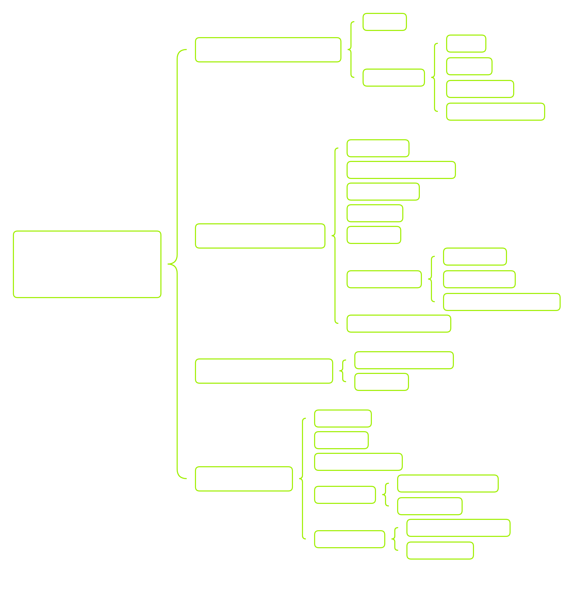

# Boot下的文件夹
- Perflogs：存放 Windows 性能日志（Performance Logs）
- Program Files：程序安装目录，系统默认路径，很多安装器会自动选择
- Program Files (x86)：在 64 位 Windows 上安装 32 位和 16 位程序
- ProgramData：隐藏文件夹，存放程序运行所需的共享数据。常用于存储许可证文件、配置文件、共享缓存
- Default用户目录：新用户登录时的模板
- AppData：每个用户的程序数据（隐藏目录），用户配置和缓存都在这里。Roaming：跨设备同步的用户数据（如自定义字典、配置），Local：本机专用数据，不同步，LocalLow：低完整性级别，用于安全模式下浏览器等
- Windows：操作系统核心文件目录
- System, System32, SysWOW64：存放核心 DLL 和 Windows API 文件
- WinSxS：Windows 组件存储，所有系统组件、更新、补丁
# access 命令
- 本地cmd：C:\Windows\System32\cmd.exe
- 远程：telnet(insecure and not recommended), Secure Shell (SSH), PsExec, WinRM, RDP

# 快捷指令
| 按键 / 命令 | 说明 |
|------------|------|
| `doskey /history` | `doskey /history` 会将当前会话中的命令历史打印到终端，或在指定参数时输出到文件。 |
| Page Up | 将当前会话历史中的第一条命令放入命令提示符中。 |
| Page Down | 将命令历史中的最后一条命令放入命令提示符中。 |
| ⇧（上箭头） | 向上滚动命令历史，查看之前执行过的命令。 |
| ⇩（下箭头） | 向下滚动命令历史，查看最近执行过的命令。 |
| ⇨（右箭头） | 将上一条命令逐字符地输入到命令提示符中。 |
| ⇦（左箭头） | 不适用（N/A）。 |
| F3 | 将上一条命令完整地重新输入到命令提示符中。 |
| F5 | 多次按下 F5 可以循环浏览之前执行过的命令。 |
| F7 | 打开一个交互式的历史命令列表。 |
| F9 | 根据输入的编号，将对应编号的历史命令输入到命令提示符中（编号对应命令在历史中的位置）。 |

# 常见目录
| 名称 | 路径 | 说明 |
|------|------|------|
| `%SYSTEMROOT%\Temp` | `C:\Windows\Temp` | 全局系统临时目录，所有用户都可访问。无论权限高低，用户在该目录中通常拥有读、写、执行权限。对低权限用户投放文件非常有用。 |
| `%TEMP%` | `C:\Users\<user>\AppData\Local\Temp` | 用户级临时目录，仅当前用户可访问。目录所有权属于对应用户。攻击者获得本地/域用户账户控制权后较为有用。 |
| `%PUBLIC%` | `C:\Users\Public` | 公共目录，任何交互式登录账户都可对其中的文件和子目录进行读、写、修改、执行等操作。可作为 Windows 全局 Temp 目录的替代方案，且通常较少被监控可疑活动。 |
| `%ProgramFiles%` | `C:\Program Files` | 存放系统中安装的所有 64 位应用程序。可用于判断目标系统上安装了哪些软件。 |
| `%ProgramFiles(x86)%` | `C:\Program Files (x86)` | 存放系统中安装的所有 32 位应用程序。可用于判断目标系统上安装了哪些软件。 |

# 搜索windows系统

# 文件查找
- where 是“找文件路径”的
- find 是“在内容里找字符串”的

# 环境变量
| 范围 | 描述 | 访问所需权限 | 登记地点 |
|------|------|--------------|----------|
| System (Machine) | 系统作用域包含作系统（OS）定义的环境变量，所有登录系统的用户和账户均可全局访问。作系统要求这些变量正常工作，并在运行时加载。 | 本地管理员或域管理员 | HKEY_LOCAL_MACHINE\SYSTEM\CurrentControlSet\Control\Session Manager\Environment |
| User | 用户范围包含当前活跃用户定义的环境变量，仅对他们开放，其他能登录同一系统的用户则无法访问。 | 当前活跃用户、本地管理员或域管理员 | HKEY_CURRENT_USER\Environment |
| Process | 进程作用域包含在当前运行进程上下文中定义和访问的环境变量。由于它们是短暂的，它们的寿命仅持续到最初定义的当前运行过程。它们还继承系统/用户作用域及其生成的父进程的变量（仅当父进程是子进程时）。 | 当前子进程、父进程或当前活跃用户 | None (Stored in Process Memory) |

重要的环境变量：
| 变量名称 | 描述 |
|----------|------|
| %PATH% | 指定可执行程序所在的一组目录（位置），系统会在这些路径中查找可执行文件。 |
| %OS% | 当前用户工作站正在运行的操作系统。 |
| %SYSTEMROOT% | 系统定义的只读变量，包含 Windows 系统目录。Windows 核心功能依赖这里的文件，包括重要数据、系统核心二进制文件和配置文件。通常为 `C:\Windows`。 |
| %LOGONSERVER% | 提供当前活跃用户的登录服务器以及机器主机名。可用于判断机器是否加入域（Domain）或工作组（Workgroup）。 |
| %USERPROFILE% | 提供当前活跃用户的主目录路径，通常为 `C:\Users\{username}`。 |
| %ProgramFiles% | 包含系统上所有 64 位程序的安装目录，通常为 `C:\Program Files`。 |
| %ProgramFiles(x86)% | 包含系统上所有 32 位程序的安装目录（仅在 64 位系统可用），通常为 `C:\Program Files (x86)`。可用于判断主机架构（x86 vs x64）。 |

# cmd & powershell
cmd更隐蔽

powershell，shift+tab可以自动补全命令，常见快捷键：
# PowerShell 常用快捷键

| 快捷键 | 描述 |
|--------|------|
| CTRL+R | 让历史命令可搜索。在之后输入命令时，会显示与之前命令匹配的结果。 |
| CTRL+L | 快速清屏。 |
| CTRL+ALT+Shift+? | 打印 PowerShell 能识别的全部快捷键列表。 |
| Escape | 在 CLI 中输入时，按 Escape 可以清除整行，无需按空格。 |
| ↑ | 向上翻阅之前的历史命令。 |
| ↓ | 向下翻阅之前的历史命令。 |
| F7 | 调出一个可滚动互动的历史命令列表（TUI）。 |

# powershell脚本库

- 工具库：
https://github.com/PowerShellMafia/PowerSploit 目录：PowerSploit.psd1
- 发现powershell社区脚本库
https://www.powershellgallery.com/   系统内置了命令Get-Command -Module PowerShellGet，负责和 PowerShell Gallery（官方模块仓库） 打交道。官方的库不用再绕excution 限制，可以直接用

* 为什么 GitHub 下来的模块要手动 Import？
PowerShell 只会自动加载放在 标准模块路径里的模块，且结构符合规范。标准路径是$env:PSModulePath，比如：C:\Program Files\WindowsPowerShell\Modules，"C:\Users\<user>\Documents\WindowsPowerShell\Modules"。如果github下载不在指定路径就要导入
* 什么是 PowerShell Profile？为什么能“永久生效”？
$PROFILE，是PowerShell 启动时自动执行的脚本的路径，如果被篡改，模块会被自动加载，比如加入Import-Module C:\htb\PowerSploit\PowerSploit.psd1

## Execution Policy
Execution Policy 决定：PowerShell 在当前环境下 允不允许你运行脚本 / 模块。控制的是：.ps1.psm1.psd1从文件加载的 PowerShell 代码。使用Get-ExecutionPolicy 查看当前策略是否被限制

## 常用PowerShell 模块和项目
- AdminToolbox：AdminToolbox 是一组非常实用的模块集合，允许系统管理员执行各种管理操作，涵盖但不限于：Active Directory 管理, Exchange 管理,网络管理, 文件与存储相关问题以及更多系统管理任务

- ActiveDirectory：该模块是一组用于 Active Directory 的本地和远程管理工具。我们可以使用它来管理：用户，组，权限，以及更多 AD 相关对象

- Empire / Situational Awareness：这是一个由 PowerShell 模块和脚本组成的集合，用于为我们提供目标主机及其所属域环境的态势感知（Situational Awareness）。该项目目前由 BC Security 作为其 Empire 框架的一部分进行维护。

- Inveigh：Inveigh 是一个用于执行 网络欺骗（Network Spoofing） 和 中间人攻击（Man-in-the-Middle, MITM） 的工具。

- BloodHound / SharpHound：BloodHound / SharpHound 允许我们使用 图形化分析工具 来直观地映射 Active Directory 环境。它通过使用 C# 和 PowerShell 编写的数据收集器 来完成信息采集和分析。

# 默认local用户
- Administrator:此帐户用于在本地主机上执行管理任务。
- Default Account：默认账户由系统用于运行多用户认证应用程序，如 Xbox 工具。
- Guest Account：此账户是一个权限有限的账户，允许没有普通用户账户的用户访问主机。默认情况下此账户是禁用的，并且应保持禁用状态。
- WDAGUtility Account：此帐户用于 Defender 应用程序防护，可以对应用程序会话进行沙箱隔离。

# 域用户
域内的用户可以切换多local用户主机

# 域管理
RSAT 是微软官方的“远程管理工具套件”，AdminToolbox是powershell 社区维护的
## 域身份标识
- Object Class： 指定对象是用户、计算机还是其他类型的对象。
- DistinguishedName： 指定对象在 AD 模式中的相对路径。
- Enabled： 告诉我们用户是否活跃并能登录。
- SamAccountName： 用于登录 ActiveDirectory 主机的用户名表示。
- ObjectGUID： 是用户对象的唯一标识符。

## 常用powershell命令
| Command          | 常见别名                     | 说明 |
|------------------|------------------------------|------|
| Get-Item         | gi                           | 获取一个对象（可以是文件、文件夹、注册表项等）。 |
| Get-ChildItem    | ls / dir / gci               | 列出文件夹或注册表 Hive 中的内容。 |
| New-Item         | md / mkdir / ni              | 创建新对象（如文件、文件夹、符号链接、注册表项等）。 |
| Set-Item         | si                           | 修改对象的属性值。 |
| Copy-Item        | copy / cp / ci               | 复制对象，创建一个副本。 |
| Rename-Item      | ren / rni                    | 重命名对象。 |
| Remove-Item      | rm / del / rmdir             | 删除对象。 |
| Get-Content      | cat / type                   | 显示文件或对象中的内容。 |
| Add-Content      | ac                           | 向文件末尾追加内容。 |
| Set-Content      | sc                           | 使用新数据覆盖文件中的原有内容。 |
| Clear-Content    | clc                          | 清空文件内容，但不删除文件本身。 |
| Compare-Object   | diff / compare               | 比较两个或多个对象（包括对象本身及其内容差异）。 |

比如创建新item： ni "README.md" -itemtype file

## powershell的输出说明
- Object（对象） 是 PowerShell 中 Class（类）的一个实例（instance）。
- Class（类） 是对象的 蓝图 / 模板 / 规范（schema / blueprint），
定义了一个对象“应该长什么样、有什么属性、能干什么”。
- Properties（属性） 是对象所包含的 数据（data）。